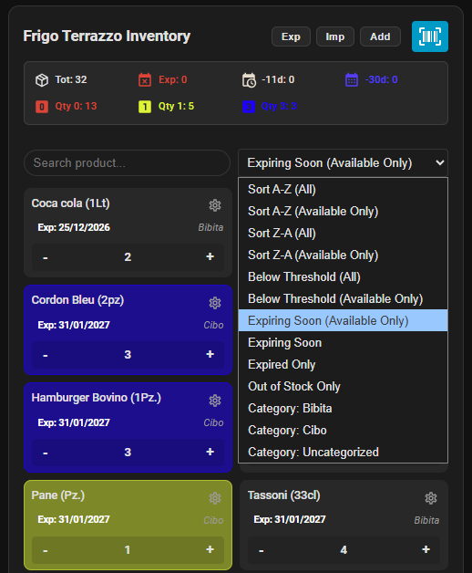
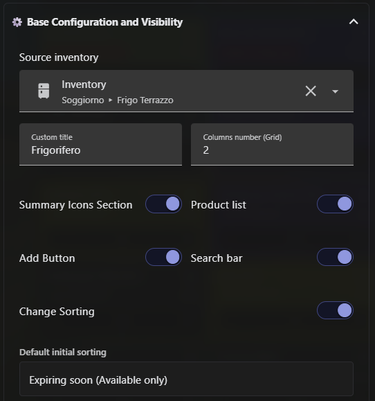
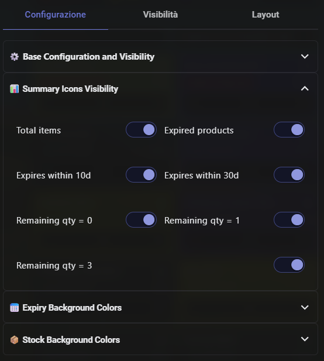
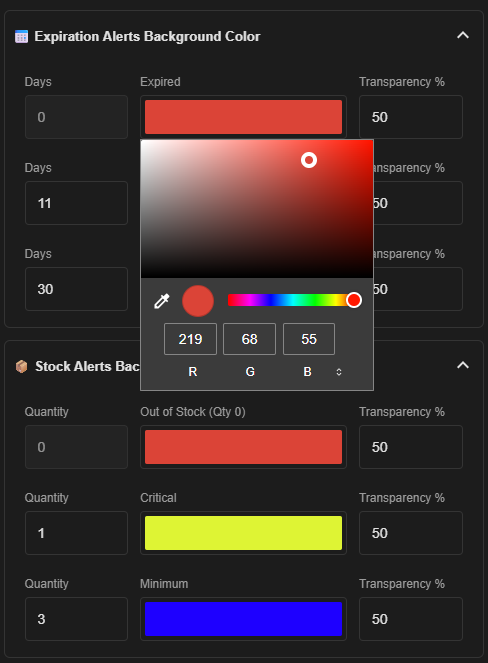

# 📦 Simple Inventory Enhanced Card

[](https://gitlab.com)
[](https://opensource.org/licenses/MIT)

🌐 **Select Language:**  
*   [English Version 🇬🇧](#-english-version)
*   [Versione Italiana 🇮🇹](#-versione-italiana)





---

# 🇬🇧 English Version

An advanced, modular, and multilingual frontend card for **Home Assistant**, designed to extend and elevate the user experience of the [**Simple Inventory**](https://github.com/blaineventurine/simple_inventory) custom integration. This card transforms pantry management into a professional tracking system for stocks, expiries, and automatic grocery list generation.

## 📌 Table of Contents
1. [✨ Key Features](#-key-features)
2. [⚙️ Visual Editor and Dashboard Customization](#️-visual-editor-and-dashboard-customization)
3. [📥 Installation Guide](#-installation-guide)
4. [⚙️ Lovelace Configuration (Example YAML)](#️-lovelace-configuration-example-yaml)
5. [🛠️ Tech Stack](#️-tech-stack)
6. [🔐 Security Requirements and Camera Settings](#-security-requirements-and-camera-settings)
7. [🚀 Future Developments and Roadmap](#-future-developments-and-roadmap)
8. [📄 License](#-license)

---

## ✨ Key Features

* **🎨 Smart Pastel Graphics:** Dynamically alters the card background color based on alerts (upcoming expiry dates, already expired items, critical or out-of-stock levels) with customizable advanced HEX transparency set directly via the Lovelace editor.
* **🛒 On-Device Barcode Scanner:** Native camera integration for Android mobile devices to instantly scan EAN barcodes on products at home or in the store.
* **📡 Open Food Facts Integration:** Scanning an unknown product queries the global database in real time to automatically autofill Product Name, Category, and Net Quantity (e.g., *500 Grams*, *1 Liter*).
* **🔄 Automatic Duplicate Detection:** Scanning a barcode already in your inventory bypasses creation and opens the edit form directly to update stock levels.
* **📋 HA To-Do List Integration:** A dynamic dropdown queries Home Assistant to let you link your automatic reorder threshold directly to an actual To-Do list (e.g., *todo.grocery_list*).
* **🌍 Internationalization (i18n):** Full native support with 100% feature parity across 5 languages: English, Italian, French, German, and Spanish.
* **📱 Responsive Layout & Rigid Android Grid:** Specifically engineered to prevent text wrapping on narrow smartphone screens, eliminating Shadow DOM layout bugs on Android devices.

---

## 📥 Installation Guide

### 1. Manual Installation Guide (via HACS)
1. Open Home Assistant and click **HACS** in the sidebar.
2. Click the **three dots** in the top-right corner and select **Custom repositories**.
3. Paste the GitHub repository URL into the text box:
   `https://github.com/ciocotab-cpu/simple-inventory-enhanced-card`
4. Under **Category**, select **Dashboard** (or *Lovelace*, *Plugin*).
5. Click **Add**.
6. The card will appear in your HACS list under "New repositories".
7. Click the card and select **Download** at the bottom right, picking the latest available release.
8. Once downloaded, click **Reload** if prompted to clear the Home Assistant browser cache.

### 2. Manual Installation Guide (without HACS)
1. Click the **pencil icon** (Edit Dashboard) in the top-right corner of your Home Assistant dashboard.
2. Click the **three dots** in the top-right corner and select **Manage Resources**.
3. Click the **Add Resource** button at the bottom right.
4. Paste this URL into the text box: `https://github.com/ciocotab-cpu/simple-inventory-enhanced-card/simple-inventory-enhanced-card.js`
5. Select **JavaScript Module** and click **Create**.
6. Refresh the page using `CTRL + F5`.

---

## ⚙️ Visual Editor and Dashboard Customization

All card preferences can be managed and expanded via the integrated **Lovelace Visual Editor** without writing YAML code manually:

* **📐 Dynamic Grid & Columns:** Customize the column count to fit the product layout to any device screen (PC, Tablet, or Smartphone).
* **📥 Import & Export:** Built-in features to export your entire inventory database to text or import bulk product entries in seconds.
* **🔌 Selective Component Toggles:** Hide or show individual UI elements via visual toggles in the editor to declutter your interface:
    * Summary Icons Section (Total counters, expired items, low stock, etc.).
    * Search Bar (Instant live filter and rapid barcode scan input).
    * Sorting Options (Dropdown menu for sorting criteria and dynamic categories).
    * Product List (The main grid displaying product cards).
    * Product Addition Form (Visibility of the "Add" button at top right).

---

## 🛠️ Tech Stack

1. **Core Backend:** Simple Inventory Python Integration (Home Assistant custom component).
2. **Scanner Engine:** Html5-QRCode (Local JavaScript library loaded *on-demand* to decode EAN-13, EAN-8, and Code-128 formats).
3. **Database Provider:** Open Food Facts API v3 (Open-source database used to pull product metadata).

---

## 🔐 Security Requirements and Camera Settings

Due to strict privacy and sandboxing policies in modern browsers (Google Chrome, Android WebView, etc.), **the camera will only launch within a secure context**.

### 1. Secure Connection (Recommended)
Access Home Assistant using an encrypted **`https://`** URL (e.g., via *Nabu Casa Cloud*, *DuckDNS Let's Encrypt*, or a reverse SSL proxy).

### 2. Local IP Override (Bypass for `http://` connections)
If you access Home Assistant solely through an internal IP address (e.g., `http://1.xx`), force your browser to treat the origin as secure:
1. Open **Google Chrome** on your PC or Android device.
2. Navigate to: `chrome://flags/#unsafely-treat-insecure-origin-as-secure`
3. Set the option to **`Enabled`**.
4. Enter your Home Assistant URL into the text field (e.g., `http://1.xx`).
5. Click **`Relaunch`** at the bottom right to restart Chrome.

### 3. Android Permissions
Ensure the official Home Assistant app (or Chrome on mobile) has system permissions to access your camera (*Settings ➡️ Apps ➡️ Home Assistant ➡️ Permissions ➡️ Camera ➡️ Allow*).

---

## 🚀 Future Developments and Roadmap

Upcoming card releases will focus on performance enhancements, interactive shortcuts, and refined UI layouts:

* ⚡ **Editor Optimization:** Refactor the configuration script to accelerate initial loading times for the Lovelace visual editor.
* 📦 **Official HACS Submission:** Register the card in the public HACS repository to enable direct installation without manual URL entries.
* 🔗 **To-Do List Shortcut:** Allow tapping directly on a product's linked shopping list icon to open the corresponding Home Assistant list in a popup.
* 🔔 **Custom Warning Days Logic:** Implement a feature using user-defined "warning days" so expiry alerts (yellow/orange card highlighting) trigger based on custom thresholds rather than fixed 10- or 30-day windows.
* 📐 **Import/Export UI Redesign:** Relocate Import and Export controls to a more discreet, integrated location within the layout.

---

## ⚙️ Lovelace Configuration (Example YAML)

While configuration via the visual UI editor is recommended, here is an example of the YAML configuration stored by the dashboard:

```yaml
type: custom:simple-inventory-enhanced-card
entity: sensor.simple_inventory_dispensa # Your entity created by the Python backend
columns: 2
show_search: true
show_sort: true
show_summary: true
show_items: true
show_add_form: true
color_expired: "#db4437"
alpha_expired: 20
color_10d: "#e6a23c"
alpha_10d: 15
color_qty0: "#db4437"
alpha_qty0: 30
```

---

# 🇮🇹 Versione Italiana

# 📦 Simple Inventory Enhanced Card

Un'interfaccia grafica avanzata, modulare e multilingua per **Home Assistant**, progettata per estendere ed elevare l'esperienza d'uso dell'integrazione personalizzata [**Simple Inventory**](https://github.com/blaineventurine/simple_inventory). Questa card trasforma la gestione della dispensa in un sistema professionale di tracciamento scorte, scadenze e automazione delle liste della spesa.

---

## 📌 Indice dei Contenuti
1. [✨ Funzionalità Principali](#-funzionalità-principali)
2. [⚙️ Editor Visuale e Personalizzazione della Plancia](#️-editor-visuale-e-personalizzazione-della-plancia)
3. [📥 Guida all'Installazione](#-guida-allinstallazione-tramite-hacs)
4. [⚙️ Configurazione Lovelace (YAML di esempio)](#️-configurazione-lovelace-yaml-di-esempio)
5. [🛠️ Tecnologie Utilizzate](#️-tecnologie-utilizzate)
6. [🔐 Requisiti di Sicurezza e Impostazioni della Fotocamera](#-requisiti-di-sicurezza-e-impostazioni-della-fotocamera)
7. [🚀 Sviluppi e Implementazioni Future (Roadmap)](#-sviluppi-e-implementazioni-future-roadmap)
8. [📄 Licenza](#-licenza)

---

## ✨ Funzionalità Principali

* **🎨 Grafica Pastello Intelligente:** Cambia colore di sfondo in base alle allerte (scadenze imminenti, prodotti già scaduti, scorte critiche o esaurite) con trasparenze HEX avanzate configurabili direttamente dall'editor Lovelace.
* **🛒 Scanner di Codici a Barre Locale:** Integrazione nativa della fotocamera su dispositivi mobili Android per rilevare all'istante i codici EAN dei prodotti al supermercato o in casa.
* **📡 Integrazione Smart Open Food Facts:** Se inquadri un prodotto inedito, la card interroga in tempo reale l'API mondiale recuperando istantaneamente Nome Prodotto, Categoria e Confezione netta (es. *500 Grammi*, *1 Litro*) precompilando il form.
* **🔄 Riconoscimento Duplicati Automatico:** Se scansioni un codice a barre già presente in inventario, il sistema salta la creazione e ti apre direttamente il form di modifica per aggiornare le scorte.
* **📋 Integrazione To-Do List di HA:** Un menu a tendina dinamico interroga Home Assistant per farti scegliere direttamente una delle tue liste To-Do reali (es. *todo.grocery_list*) a cui agganciare la soglia di riordino automatica.
* **🌍 Internazionalizzazione (i18n):** Supporto nativo speculare al 100% per 5 lingue: Italiano, Inglese, Francese, Tedesco e Spagnolo.
* **📱 Layout Responsive & Griglia Rigida Android:** Progettato specificamente per non andare mai a capo sugli schermi stretti degli smartphone, eliminando i bug grafici dello Shadow DOM su Android.

---

## 📥 Guida all'Installazione tramite HACS (ancora non possibile)

Grazie alla predisposizione del repository, l'installazione e la gestione degli aggiornamenti futuri avvengono in modo completamente automatico tramite **HACS (Home Assistant Community Store)**.

### 1. Guida all'Installazione manuale (tramite HACS)
1. Apri Home Assistant e clicca sulla voce **HACS** nel menu laterale.
2. Clicca sui **tre puntini** in alto a destra e seleziona **Repository personalizzati** (*Custom Repositories*).
3. Incolla l'URL del repository GitHub nella casella di testo:
   `https://github.com/ciocotab-cpu/simple-inventory-enhanced-card`
4. Sotto la voce **Categoria**, seleziona **Plancia** (o *Lovelace*, *Plugin*).
5. Clicca sul pulsante **Aggiungi**.
6. La card apparirà immediatamente nell'elenco di HACS sotto la voce "Nuovi repository".
7. Clicca sulla card e premi **Scarica** (*Download*) in basso a destra, selezionando l'ultima versione disponibile.
8. Al termine del download, se richiesto, clicca su **Ricarica il browser** (*Reload*) per aggiornare la cache grafica di Home Assistant.

### 2. Guida all'Installazione manuale (senza HACS)
1. Clicca sulla **matita** (Modifica la plancia) in alto a destra nella home page di Home Assistant.
2. Clicca sui **tre puntini** in alto a destra e seleziona **Gestisci le Risorse** (*Custom Repositories*).
3. Clicca sul pulsante **Aggiungi una risorsa** in basso a destra.
4. Incolla questo l'URL nella casella di testo: `https://github.com/ciocotab-cpu/simple-inventory-enhanced-card/simple-inventory-enhanced-card.js` 
5. Seleziona la voce **Modulo Javascript** e poi clicca su **Crea**.
6. Ricarica la pagina con CTRL + F5.

---

## ⚙️ Editor Visuale e Personalizzazione della Plancia

Tutte le preferenze della card possono essere gestite ed estese comodamente tramite l'**Editor Visuale Interattivo** integrato in Lovelace, senza la necessità di scrivere codice YAML a mano:

* **📐 Griglia e Colonne Dinamiche:** È possibile personalizzare il numero di colonne per adattare la visualizzazione della griglia dei prodotti a qualsiasi tipo di schermo (PC, Tablet o Smartphone).
* **📥 Import & Export:** La card integra funzioni avanzate per esportare l'intero database della dispensa in formato testuale o importare stock massivi di prodotti in pochissimi secondi.
* **🔌 Disattivazione Selettiva dei Componenti:** Attraverso i comodi interruttori (toggle) grafici dell'editor, puoi nascondere o mostrare singolarmente le varie aree della card per ripulire l'interfaccia:
    * Sezione Icone di Riepilogo (Contatori totali, prodotti scaduti, in esaurimento, ecc.).
    * Barra di ricerca (Filtro istantaneo e inserimento rapido tramite scanner barcode).
    * Cambia Ordinamento (Menu a tendina dei criteri di tri e categorie dinamiche).
    * Elenco dei prodotti (La griglia principale con le tessere degli articoli).
    * Inserimento prodotto (La visibilità del tasto "Aggiungi" in alto a destra).

---

## 🛠️ Tecnologie Utilizzate

1. **Backend Core:** Simple Inventory Python Integration (componente personalizzato per Home Assistant).
2. **Motore di Scansione:** Html5-QRCode (libreria JavaScript locale integrata *on-demand* per la decodifica dei formati EAN-13, EAN-8 e Code-128).
3. **Database Informazioni:** Open Food Facts API v3 (servizio open-source per l'estrazione delle schede tecniche dei prodotti).

---

## 🔐 Requisiti di Sicurezza e Impostazioni della Fotocamera

A causa delle rigide politiche di privacy e sandbox dei browser moderni (Google Chrome, Android WebView, ecc.), **la fotocamera si attiverà solo se viene garantito un contesto sicuro**.

### 1. Connessione Sicura (Consigliata)
Accedi a Home Assistant utilizzando un URL protetto crittografato **`https://`** (es. tramite *Nabu Casa Cloud*, *DuckDNS Let's Encrypt* o proxy SSL inverso).

### 2. Sblocco via IP Locale (Bypass per connessioni `http://`)
Se accedi a Home Assistant solo tramite indirizzo IP interno (es. `http://1.xx`), devi forzare il browser a considerare sicuro quell'indirizzo:
1. Apri **Google Chrome** sul dispositivo Android o PC.
2. Digita nella barra degli indirizzi: `chrome://flags/#unsafely-treat-insecure-origin-as-secure`
3. Imposta la voce su **`Enabled`**.
4. Inserisci l'URL del tuo Home Assistant nella casella di testo (es. `http://1.xx`).
5. Clicca su **`Relaunch`** in basso a destra per riavviare Chrome.

### 3. Permessi Android
Assicurati che l'applicazione ufficiale di Home Assistant (o Google Chrome su mobile) possieda l'autorizzazione hardware per l'utilizzo della fotocamera nelle impostazioni di sistema di Android (*Impostazioni ➡️ Applicazioni ➡️ Home Assistant ➡️ Permessi ➡️ Fotocamera ➡️ Consenti*).

---

## 🚀 Sviluppi e Implementazioni Future (Roadmap)

Le prossime versioni della card si concentreranno sull'ottimizzazione delle performance, su nuove scorciatoie interattive e su una migliore disposizione degli elementi:

* ⚡ **Ottimizzazione Editor:** Ottimizzare lo script di configurazione per rendere molto più veloce e reattivo il caricamento iniziale dell'editor visuale Lovelace.
* 📦 **Pubblicazione ufficiale su HACS:** Registrare la card come archivio ufficiale nel catalogo pubblico di HACS per consentire l'installazione automatica senza inserire l'URL.
* 🔗 **Scorciatoia Liste To-Do:** Introdurre la possibilità di cliccare direttamente sull'icona della lista della spesa associata a un prodotto per aprire istantaneamente la relativa lista di Home Assistant in un popup.
* 🔔 **Logica Giorni di Preavviso:** Sviluppare un sistema che sfrutti attivamente i "giorni di preavviso" impostati, in modo da far attivare l'allerta di scadenza (sfondo giallo/arancione della tessera) esattamente al raggiungimento della soglia personalizzata di giorni inserita dall'utente, anziché basarsi su intervalli fissi a 10 o 30 giorni.
* 📐 **Restyling Interfaccia Import/Export:** Riposizionare i tasti di Import ed Export in una zona più strategica, discreta e visivamente integrata nel layout della card.

---

## ⚙️ Configurazione Lovelace (YAML di esempio)

Anche se è consigliabile configurarla graficamente tramite l'interfaccia visiva dell'Editor, ecco un esempio di configurazione testuale YAML memorizzato dalla plancia:

```yaml
type: custom:simple-inventory-enhanced-card
entity: sensor.simple_inventory_dispensa # La tua entità generata dal backend Python
columns: 2
show_search: true
show_sort: true
show_summary: true
show_items: true
show_add_form: true
color_expired: "#db4437"
alpha_expired: 20
color_10d: "#e6a23c"
alpha_10d: 15
color_qty0: "#db4437"
alpha_qty0: 30
```

---
## 📄 Licenza
Il progetto è rilasciato sotto licenza MIT. Open Food Facts è un database aperto regolato da licenza ODbl.
