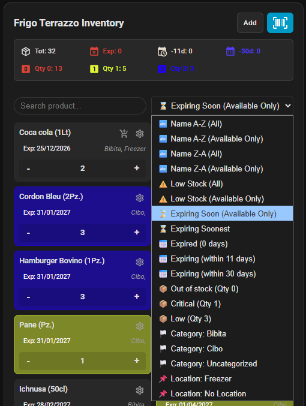
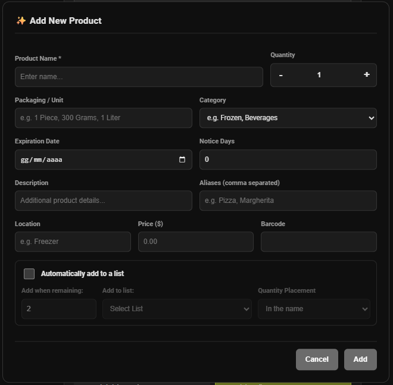
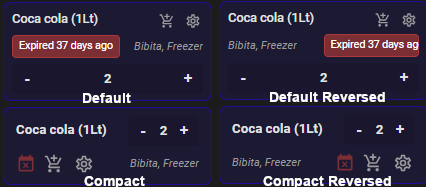
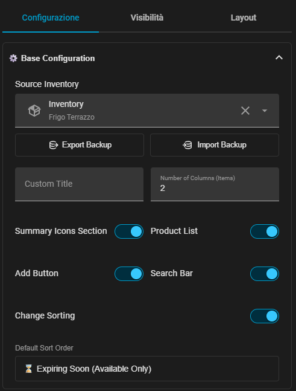
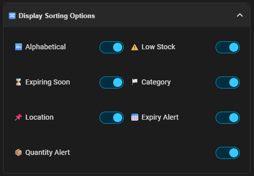
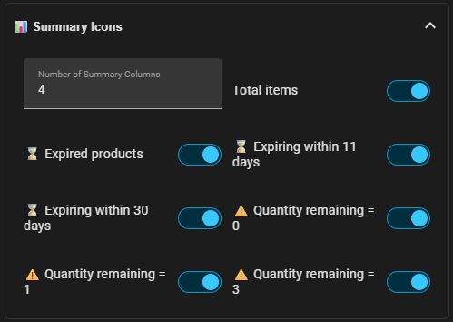
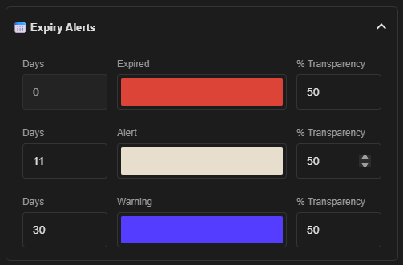
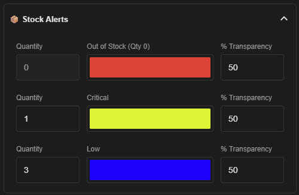
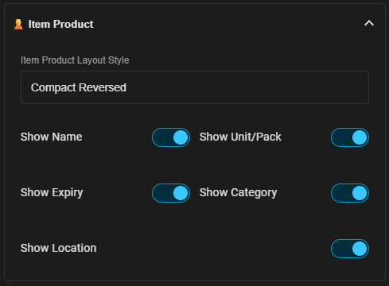

# 📦 Simple Inventory Enhanced Card

[](https://gitlab.com)
[](https://opensource.org/licenses/MIT)
<a href="https://www.buymeacoffee.com/ciocotab" target="_blank" rel="noreferrer noopener"></a>
<a href="https://www.paypal.com/myaccount/transfer/homepage/external/profile?flowContextData=mzq-R_8FOQdhsKxFCaHMvh-FQbxugbOz1hlsuniz4OpES20TJ-qm2KlvfzTtLn7OQfuXHWOHvAisKPGzJc4bSZwsv5zF2yM2hA9E8a4fC0PeSh4pVdRoVf3Ndkp1jjjSCdEt4--eyvw0sV4PbhRdSnLjtQifYLg-uNB7UBTBFnmbDPwTW154Uj5eQ_f3kLiGq1c6qh4u_pG2UmujY2c4lzw_-4ngkXLYkWMTmGf-4fi15oAwPJOdSjVrECUh8b3tX4P9Z_RI6FKVBGiBp9v7t2c9SQin4QOc6hICRaPmSl4h4X4bFphK9Heyz4O0Zs_gGiMZgL9UECNXTwYonPI4LDzKTvpVEXPHFXck7j9pta8cTtRI9bnTjTEL37G9jsZHtrM0M_NHq2lX8IhK1y_lxVnuYeFVlBwDvI6_uSzSV80kfNyscsRP6VKq-l8" target="_blank" rel="noreferrer noopener"></a>

🌐 **Select Language:**  
*   [English Version 🇬🇧](#-english-version)
*   [Versione Italiana 🇮🇹](#-versione-italiana)










---

# 🇬🇧 English Version

# 📦 Simple Inventory Enhanced Card

An advanced, modular, and multilingual custom card for **Home Assistant**, designed to extend and elevate the user experience of the [**Simple Inventory**](https://github.com/blaineventurine/simple_inventory) custom integration. This card transforms pantry management into a professional system for stock tracking, expiration alerts, and shopping list automation.

---

## 📌 Table of Contents
1. [✨ Key Features](#-key-features)
2. [⚙️ Visual Editor & Dashboard Customization](#️-visual-editor--dashboard-customization)
3. [📥 Installation Guide](#-installation-guide)
4. [⚙️ Lovelace Configuration (YAML Example)](#️-lovelace-configuration-yaml-example)
5. [🛠️ Technologies Used](#️-technologies-used)
6. [🔐 Security Requirements & Camera Settings](#-security-requirements--camera-settings)
7. [🚀 Future Developments & Roadmap](#-future-developments--roadmap)
8. [📄 License](#-license)

---

## ✨ Key Features

* **🎨 Smart Graphics:** Changes background color based on alert states (upcoming expirations, expired products, critical or out-of-stock items) with customizable thresholds, colors, and transparency directly from the Lovelace editor.
* **🛒 Local Barcode Scanner:** Native camera integration on Android mobile devices to instantly scan product EAN barcodes at the supermarket or home.
* **📡 Smart Open Food Facts Integration:** Scanning a new product queries the global API in real-time to retrieve Product Name, Category, and Net Quantity (e.g., *500 Grams*, *1 Liter*), pre-filling the form automatically.
* **🔄 Automatic Duplicate Recognition:** If you scan a barcode already present in the inventory, the system skips creation and opens the edit form to update stock quantities directly.
* **📋 HA To-Do List Integration:** A dynamic dropdown queries Home Assistant to let you pick a real To-Do list (e.g., `todo.grocery_list`) to bind automatic reorder thresholds.
* **🌍 Internationalization (i18n):** 100% native mirrored support for 5 languages: Italian, English, French, German, and Spanish.
* **📱 Responsive Layout & Rigid Android Grid:** Specifically designed to avoid text wrapping on narrow smartphone screens, eliminating Shadow DOM rendering bugs on Android.

---

## 📥 Installation Guide

### 1. Custom Installation via HACS (Custom Repository)
1. Open Home Assistant and click **HACS** in the sidebar.
2. Click the **three dots** in the upper right corner and select **Custom Repositories**.
3. Paste the GitHub repository URL into the text box:  
   `https://github.com/ciocotab-cpu/simple-inventory-enhanced-card`
4. Under **Category**, select **Dashboard** (or *Lovelace*, *Plugin*).
5. Click the **Add** button.
6. The card will appear in the HACS list under "New Repositories".
7. Click the card and press **Download** in the bottom right corner, selecting the latest available version.
8. Once downloaded, click **Reload** if prompted to refresh the browser cache.

### 2. Manual Installation (without HACS)
1. Click the **pencil icon** (Edit Dashboard) in the upper right corner of your Home Assistant dashboard.
2. Click the **three dots** in the upper right corner and select **Manage Resources**.
3. Click the **Add Resource** button in the bottom right.
4. Paste this URL into the text box: `https://github.com/ciocotab-cpu/simple-inventory-enhanced-card/simple-inventory-enhanced-card.js` 
5. Select **JavaScript Module** and click **Create**.
6. Hard reload the page (CTRL + F5).

---

## ⚙️ Visual Editor & Dashboard Customization

All card preferences can be managed and extended using the integrated **Interactive Visual Editor** in Lovelace, without writing YAML code manually:

* **📐 Dynamic Grid & Columns:** Customize the number of columns to adapt the product grid layout to any screen size (PC, Tablet, or Smartphone).
* **📥 Import & Export:** Built-in options to export your entire pantry database in text format or import bulk product stock in seconds.
* **🔌 Selective Component Disabling:** Toggle visibility switches in the editor to hide or show individual card sections to declutter your interface:
    * Summary Icons Section (Total counters, expired products, low stock, etc.).
    * Search Bar (Instant filtering and quick addition via barcode scanner).
    * Sorting Options (Dropdown menu for sorting criteria and dynamic categories).
    * Product List (Main grid displaying item cards).
    * Add Product (Visibility of the "Add" button in the upper right).

---

## 🛠️ Technologies Used

1. **Backend Core:** [**Simple Inventory**](https://github.com/blaineventurine/simple_inventory) (Custom component for Home Assistant available via HACS).
2. **Scanner Engine:** Html5-QRCode v2.3.8 (Local JavaScript library loaded *on-demand* to decode EAN-13, EAN-8, and Code-128 formats).
3. **Database Provider:** Open Food Facts API v3 (Open-source database used for product information extraction).

---

## 🔐 Security Requirements & Camera Settings

Due to strict privacy and sandboxing policies in modern browsers (Google Chrome, Android WebView, etc.), **the camera will only activate within a secure context**.

### 1. Secure Connection (Recommended)
Access Home Assistant using an encrypted **`https://`** URL (e.g., via *Nabu Casa Cloud*, *DuckDNS Let's Encrypt*, or a reverse SSL proxy).

### 2. Local IP Bypass (Workaround for `http://` connections)
If you access Home Assistant using a local IP address (e.g., `http://1.xx`), force the browser to treat that address as secure:
1. Open **Google Chrome** on your Android device or PC.
2. Enter the following in the address bar: `chrome://flags/#unsafely-treat-insecure-origin-as-secure`
3. Set the option to **`Enabled`**.
4. Enter your Home Assistant URL into the text field (e.g., `http://1.xx`).
5. Click **`Relaunch`** in the bottom right to restart Chrome.

### 3. Android Permissions
Ensure the official Home Assistant app (or Google Chrome on mobile) has hardware permission to use the camera in Android system settings (*Settings ➡️ Apps ➡️ Home Assistant ➡️ Permissions ➡️ Camera ➡️ Allow*).

---

## 🚀 Future Developments & Roadmap

Future releases will focus on performance optimization, interactive shortcuts, and layout improvements:

* 📦 **Official HACS Release:** Register the card in the default HACS store directory for automatic installation without requiring custom repository URLs.
* 📐 **Multiple Layout Options:** Additional text layout choices for item cards.
* 📐 **Summary Icon Filtering:** Clicking a summary icon will instantly filter the list by that status.
* 📐 **Failover Translation:** Translate failover strings to English (currently in Italian).

---

## ⚙️ Lovelace Configuration (YAML Example)

While configuration via the Visual Editor is recommended, here is an example of the YAML configuration generated by the dashboard:

```yaml
type: custom:simple-inventory-enhanced-card
title: 'Personal'
columns: 2
default_sort: expiry
show_summary: true
show_items: true
show_add_form: true
show_search: true
show_sort: true
show_ico_total: true
show_ico_expired: true
show_ico_10d: true
show_ico_30d: true
show_ico_qty0: true
show_ico_qty1: true
show_ico_qty3: true
color_expired: '#db4437'
color_10d: '#e8dece'
color_30d: '#543dff'
color_qty0: '#db4437'
color_qty1: '#def434'
color_qty3: '#1e00ff'
alpha_expired: 50
alpha_10d: 50
alpha_30d: 50
alpha_qty0: 50
alpha_qty1: 50
alpha_qty3: 50
entity: sensor.personal_inventory
threshold_1_days: 1000
threshold_2_days: 10000
days_10d: 11
summary_columns: 4
debug_mode: false
show_sort_alpha: true
show_sort_threshold: true
show_sort_expiry: true
show_sort_category: true
show_sort_location: true
show_sort_alert_exp: true
show_sort_alert_qty: true

```
---

# 🇮🇹 Versione Italiana

# 📦 Simple Inventory Enhanced Card

Un'interfaccia grafica avanzata, modulare e multilingua per **Home Assistant**, progettata per estendere ed elevare l'esperienza d'uso dell'integrazione personalizzata [**Simple Inventory**](https://github.com/blaineventurine/simple_inventory). Questa card trasforma la gestione della dispensa in un sistema professionale di tracciamento scorte, scadenze e automazione delle liste della spesa.

---

## 📌 Indice dei Contenuti
1. [✨ Funzionalità Principali](#-funzionalità-principali)
2. [⚙️ Editor Visuale e Personalizzazione della Plancia](#️-editor-visuale-e-personalizzazione-della-plancia)
3. [📥 Guida all'Installazione](#-guida-allinstallazione-tramite-hacs)
4. [⚙️ Configurazione Lovelace (YAML di esempio)](#️-configurazione-lovelace-yaml-di-esempio)
5. [🛠️ Tecnologie Utilizzate](#️-tecnologie-utilizzate)
6. [🔐 Requisiti di Sicurezza e Impostazioni della Fotocamera](#-requisiti-di-sicurezza-e-impostazioni-della-fotocamera)
7. [🚀 Sviluppi e Implementazioni Future (Roadmap)](#-sviluppi-e-implementazioni-future-roadmap)
8. [📄 Licenza](#-licenza)

---

## ✨ Funzionalità Principali

* **🎨 Grafica Intelligente:** Cambia colore di sfondo in base alle allerte (scadenze imminenti, prodotti già scaduti, scorte critiche o esaurite) con soglie/colori/trasparenze configurabili direttamente dall'editor Lovelace.
* **🛒 Scanner di Codici a Barre Locale:** Integrazione nativa della fotocamera su dispositivi mobili Android per rilevare all'istante i codici EAN dei prodotti al supermercato o in casa.
* **📡 Integrazione Smart Open Food Facts:** Se inquadri un prodotto inedito, la card interroga in tempo reale l'API mondiale recuperando istantaneamente Nome Prodotto, Categoria e Confezione netta (es. *500 Grammi*, *1 Litro*) precompilando il form.
* **🔄 Riconoscimento Duplicati Automatico:** Se scansioni un codice a barre già presente in inventario, il sistema salta la creazione e ti apre direttamente il form di modifica per aggiornare le scorte.
* **📋 Integrazione To-Do List di HA:** Un menu a tendina dinamico interroga Home Assistant per farti scegliere direttamente una delle tue liste To-Do reali (es. *todo.grocery_list*) a cui agganciare la soglia di riordino automatica.
* **🌍 Internazionalizzazione (i18n):** Supporto nativo speculare al 100% per 5 lingue: Italiano, Inglese, Francese, Tedesco e Spagnolo.
* **📱 Layout Responsive & Griglia Rigida Android:** Progettato specificamente per non andare mai a capo sugli schermi stretti degli smartphone, eliminando i bug grafici dello Shadow DOM su Android.

---

## 📥 Guida all'Installazione tramite HACS (ancora non possibile)

Grazie alla predisposizione del repository, l'installazione e la gestione degli aggiornamenti futuri avvengono in modo completamente automatico tramite **HACS (Home Assistant Community Store)**.

### 1. Guida all'Installazione manuale (tramite HACS)
1. Apri Home Assistant e clicca sulla voce **HACS** nel menu laterale.
2. Clicca sui **tre puntini** in alto a destra e seleziona **Repository personalizzati** (*Custom Repositories*).
3. Incolla l'URL del repository GitHub nella casella di testo:
   `https://github.com/ciocotab-cpu/simple-inventory-enhanced-card`
4. Sotto la voce **Categoria**, seleziona **Plancia** (o *Lovelace*, *Plugin*).
5. Clicca sul pulsante **Aggiungi**.
6. La card apparirà immediatamente nell'elenco di HACS sotto la voce "Nuovi repository".
7. Clicca sulla card e premi **Scarica** (*Download*) in basso a destra, selezionando l'ultima versione disponibile.
8. Al termine del download, se richiesto, clicca su **Ricarica il browser** (*Reload*) per aggiornare la cache grafica di Home Assistant.

### 2. Guida all'Installazione manuale (senza HACS)
1. Clicca sulla **matita** (Modifica la plancia) in alto a destra nella home page di Home Assistant.
2. Clicca sui **tre puntini** in alto a destra e seleziona **Gestisci le Risorse** (*Custom Repositories*).
3. Clicca sul pulsante **Aggiungi una risorsa** in basso a destra.
4. Incolla questo l'URL nella casella di testo: `https://github.com/ciocotab-cpu/simple-inventory-enhanced-card/simple-inventory-enhanced-card.js` 
5. Seleziona la voce **Modulo Javascript** e poi clicca su **Crea**.
6. Ricarica la pagina con CTRL + F5.

---

## ⚙️ Editor Visuale e Personalizzazione della Plancia

Tutte le preferenze della card possono essere gestite ed estese comodamente tramite l'**Editor Visuale Interattivo** integrato in Lovelace, senza la necessità di scrivere codice YAML a mano:

* **📐 Griglia e Colonne Dinamiche:** È possibile personalizzare il numero di colonne per adattare la visualizzazione della griglia dei prodotti a qualsiasi tipo di schermo (PC, Tablet o Smartphone).
* **📥 Import & Export:** La card integra funzioni per esportare l'intero database della dispensa in formato testuale o importare stock massivi di prodotti in pochissimi secondi.
* **🔌 Disattivazione Selettiva dei Componenti:** Attraverso i comodi interruttori (toggle) grafici dell'editor, puoi nascondere o mostrare singolarmente le varie aree della card per ripulire l'interfaccia:
    * Sezione Icone di Riepilogo (Contatori totali, prodotti scaduti, in esaurimento, ecc.).
    * Barra di ricerca (Filtro istantaneo e inserimento rapido tramite scanner barcode).
    * Cambia Ordinamento (Menu a tendina dei criteri di tri e categorie dinamiche).
    * Elenco dei prodotti (La griglia principale con le tessere degli articoli).
    * Inserimento prodotto (La visibilità del tasto "Aggiungi" in alto a destra).

---

## 🛠️ Tecnologie Utilizzate

1. **Backend Core:** [**Simple Inventory**](https://github.com/blaineventurine/simple_inventory) (componente personalizzato per Home Assistant presente su HACS).
2. **Motore di Scansione:** Html5-QRCode v 2.3.8 (libreria JavaScript locale integrata *on-demand* per la decodifica dei formati EAN-13, EAN-8 e Code-128).
3. **Database Informazioni:** Open Food Facts API v3 (servizio open-source per l'estrazione delle schede tecniche dei prodotti).

---

## 🔐 Requisiti di Sicurezza e Impostazioni della Fotocamera

A causa delle rigide politiche di privacy e sandbox dei browser moderni (Google Chrome, Android WebView, ecc.), **la fotocamera si attiverà solo se viene garantito un contesto sicuro**.

### 1. Connessione Sicura (Consigliata)
Accedi a Home Assistant utilizzando un URL protetto crittografato **`https://`** (es. tramite *Nabu Casa Cloud*, *DuckDNS Let's Encrypt* o proxy SSL inverso).

### 2. Sblocco via IP Locale (Bypass per connessioni `http://`)
Se accedi a Home Assistant solo tramite indirizzo IP interno (es. `http://1.xx`), devi forzare il browser a considerare sicuro quell'indirizzo:
1. Apri **Google Chrome** sul dispositivo Android o PC.
2. Digita nella barra degli indirizzi: `chrome://flags/#unsafely-treat-insecure-origin-as-secure`
3. Imposta la voce su **`Enabled`**.
4. Inserisci l'URL del tuo Home Assistant nella casella di testo (es. `http://1.xx`).
5. Clicca su **`Relaunch`** in basso a destra per riavviare Chrome.

### 3. Permessi Android
Assicurati che l'applicazione ufficiale di Home Assistant (o Google Chrome su mobile) possieda l'autorizzazione hardware per l'utilizzo della fotocamera nelle impostazioni di sistema di Android (*Impostazioni ➡️ Applicazioni ➡️ Home Assistant ➡️ Permessi ➡️ Fotocamera ➡️ Consenti*).

---

## 🚀 Sviluppi e Implementazioni Future (Roadmap)

Le prossime versioni della card si concentreranno sull'ottimizzazione delle performance, su nuove scorciatoie interattive e su una migliore disposizione degli elementi:

* 📦 **Pubblicazione ufficiale su HACS:** Registrare la card come archivio ufficiale nel catalogo pubblico di HACS per consentire l'installazione automatica senza inserire l'URL.
* 📐 **Layout Multipli:** Più configurazioni della disposizione dei testi per la scheda oggetto.
* 📐 **Puntamento Icone di Riepilogo:** Al click su un'icona di riepilogo, viene visualizzata la lista corrispondente.
* 📐 **Testi di FailOver:** Traduzione in inglese dei testi failover (ora in italiano).

---

## ⚙️ Configurazione Lovelace (YAML di esempio)

Anche se è consigliabile configurarla graficamente tramite l'interfaccia visiva dell'Editor, ecco un esempio di configurazione testuale YAML memorizzato dalla plancia:

```yaml
type: custom:simple-inventory-enhanced-card
title: 'Personal'
columns: 2
default_sort: expiry
show_summary: true
show_items: true
show_add_form: true
show_search: true
show_sort: true
show_ico_total: true
show_ico_expired: true
show_ico_10d: true
show_ico_30d: true
show_ico_qty0: true
show_ico_qty1: true
show_ico_qty3: true
color_expired: '#db4437'
color_10d: '#e8dece'
color_30d: '#543dff'
color_qty0: '#db4437'
color_qty1: '#def434'
color_qty3: '#1e00ff'
alpha_expired: 50
alpha_10d: 50
alpha_30d: 50
alpha_qty0: 50
alpha_qty1: 50
alpha_qty3: 50
entity: sensor.personal_inventory
threshold_1_days: 1000
threshold_2_days: 10000
days_10d: 11
summary_columns: 4
debug_mode: false
show_sort_alpha: true
show_sort_threshold: true
show_sort_expiry: true
show_sort_category: true
show_sort_location: true
show_sort_alert_exp: true
show_sort_alert_qty: true

```

---
## 📄 Licenza
Il progetto è rilasciato sotto licenza MIT. Open Food Facts è un database aperto regolato da licenza ODbl.
